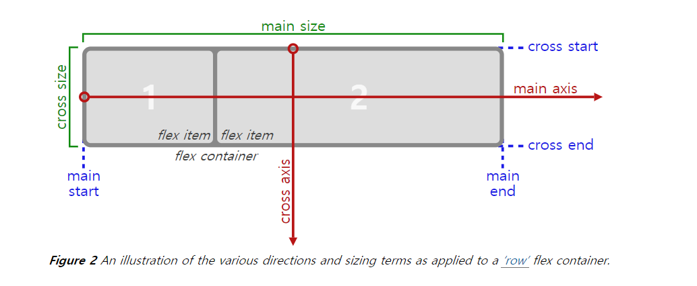
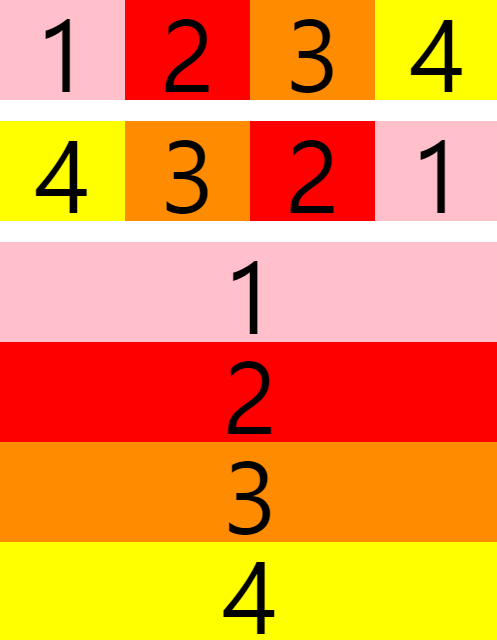
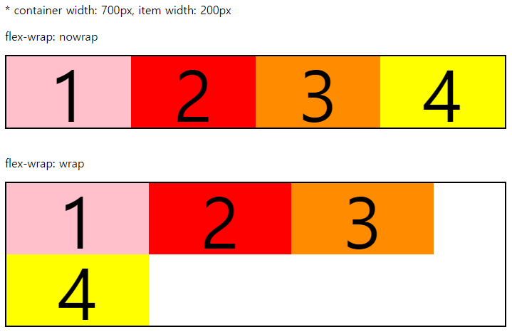
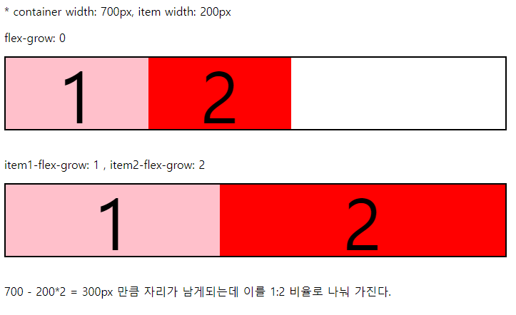
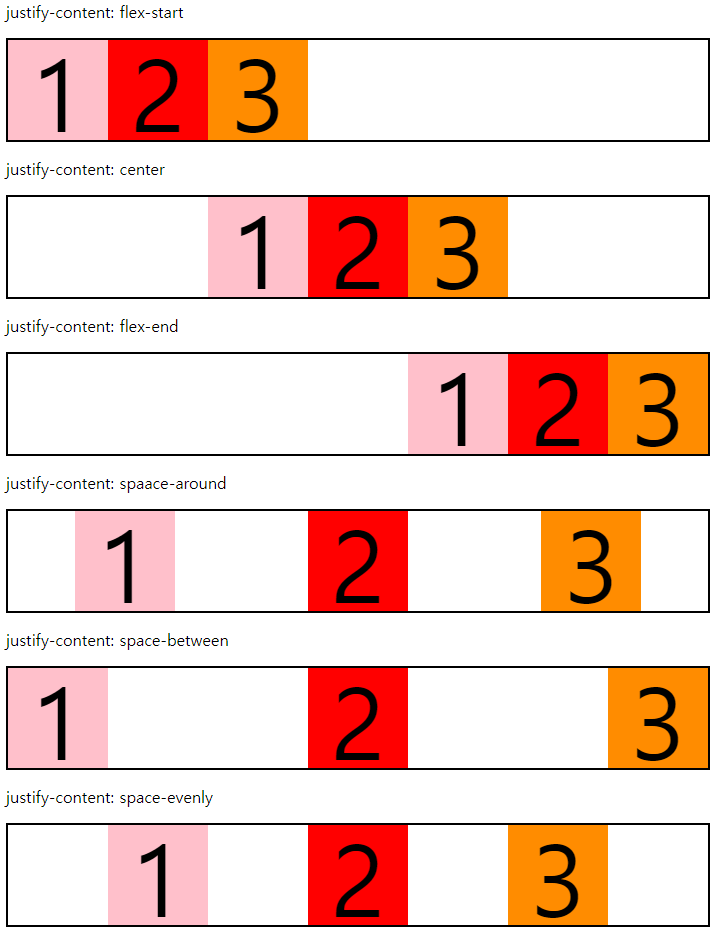
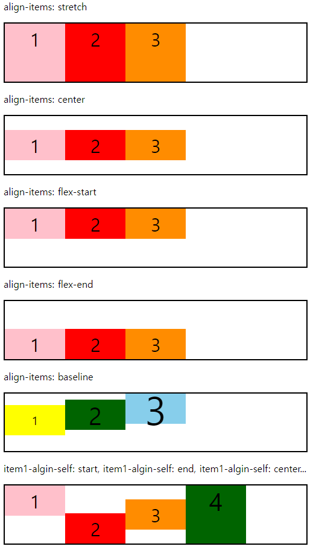

# Flexbox
> `반응형 웹` 이라 함은 다양한 뷰포트에 대하여 화면이 자동으로 그에 맞게 변하도록 하는 웹페이지를 말한다. 이는 컴퓨터의 모니터, 스마트폰, 태블릿 등 다양한 디바이스에서 웹페이지를 불러오게 되기 때문에 이에 맞게 자연스러운 레이아웃을 보여주는 것이 필요해졌기 때문이다.

반응형 웹을 구현하기 위해서는 다양한 기술들이 있지만 이 레포지토리에서는 CSS3의 `Flexbox`의 기능에 대해 알아보도록 한다. `Flexbox`의 기본적인 성질과 사용법에 대해 익히고 각각의 속성에 따라 화면이 어떻게 변하는지 알아보도록 한다.  
 

## Flexbox의 구성
  

Flex의 구성은 여러 자식요소인 flex item과 상위 부모 요소인 flex container로 이루어져 있다. 위 사진[1](#footnote_1)을 참고하면서 다음 flexbox가 동작하는 방식을 이해하도록 한다.  
 

### flex-direction
자식요소의 나열 방향을 지정하는 속성이다. 기본적으로 main axis에 따라 나열되며 속성값에 따라 cross axis을 기준으로 할 수 있고 반대로 나열할 수도 있다. 기본값은 `'row'`이며 `'row-reverse'`, `'column'`, `'column-reverse'` 가 있다.  

블럭 1,2,3,4 에 대하여 차례대로 row, row-reverse, column의 결과이다.  
 

### flex-wrap
Item을 나열했을 때 main size보다 item들의 넓이가 클 경우 어떻게 처리할 것인지 정하는 속성이다. 기본값은 `'nowrap'`이며 이는 item의 넓이를 줄이더라도 main size내에 item을 모두 나열한다. 반면에 `'wrap'`은 main size보다 클 경우 다음 row로 넘긴다. 아래 사진을 보고 생각해보자.

  
 

### flex-grow
Item을 나열했을 때 main size를 다 못 채울 경우 남는 자리를 grow 값의 비율에 따라 나눠 가진다. 기본값은 0이며 이는 grow 적용을 받지 못한다. 이외의 숫자는 그 비율 만큼 자리를 나눠 가진다.

  
 

### justify-content
Item을 main axis를 기준으로 나열하는 방법을 나타낸다.
* 기본값 : `flex-start`
* flex-start
* flex-end
* center
* space-around
* space-between
* space-evenly

  
 

### align-items
Item을 cross axis를 기준으로 나열하는 방법을 나타낸다.
* 기본값 : stretch
* stretch
* flex-start
* flex-end
* baseline
* center

위와 같이 container에 속성을 부여하여 일괄적으로 처리할 수도 있고 align-self 속성을 사용하여 item 각각에 속성을 부여하여 처리할 수도 있다.

 
<a name="footnote_1">1 </a>: 사진 출처 - https://www.w3.org/TR/css-flexbox-1/#box-model