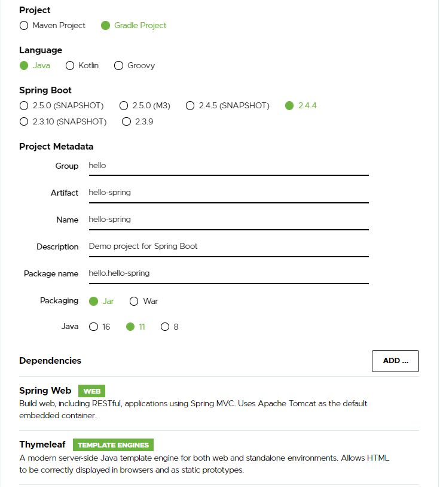
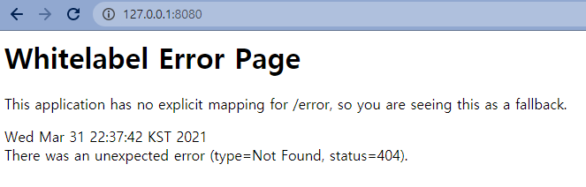

# Spring
> Spring makes programming Java quicker, easier, and safer for everybody. Spring’s focus on speed, simplicity, and productivity has made it the world's most popular Java framework.

Java 기반 웹 프레임워크 스프링  

스프링 부트를 사용하여 간단한 웹 프로젝트를 진행하면서 사용법을 익히도록 한다.  
<br/>
## 설치
스프링 공식 홈페이지 Spring initializer를 사용하여 프로젝트를 생성한다. 다음과 같은 설정을 하고 generate 한다.


  
<br/>
설치된 프로젝트를 열고 main class를 실행한 뒤 로컬호스트를 통해 접속했을 때 다음과 같은 화면이 뜨면 설치가 제대로 된 것이다.

  
<br/>

## 기본 동작 방식
`static` 경로에 다음과 같은 `index.html` 파일을 추가하고 실행해보도록 한다.
``` html
<!-- src/main/resources/static/index.html-->
<!DOCTYPE HTML>
<html>
<head>
    <title>Hello</title>
    <meta http-equiv="Content-Type" content="text/html; charset=UTF-8" />
</head>

<body>
Hello
<a href="/hello">hello</a>
</body>
</html>
```  

스프링부트는 `src/index.html` 파일을 welcome page로 사용한다.

다음은 contorller를 통해 get 요청을 처리해 보도록 한다.

다음과 같은 두 소스코드를 생성하고 브라우저를 통해 `localhost:8080/hello`에 접속해 본다.
```java
// src/main/java/hello/hellospring/controller/HelloController.java
package hello.hellospring.controller;

import org.springframework.stereotype.Controller;
import org.springframework.ui.Model;
import org.springframework.web.bind.annotation.GetMapping;

@Controller
public class HelloController {

    @GetMapping("hello")
    public String hello(Model model){
        model.addAttribute("data", "hello!!");
        return "hello";
    }
}
```  

```html
<!--src/resources/templates/hello.html-->
<html xmlns:th="http://www.thymeleaf.org">
<head>
    <title>Hello</title>
    <meta http-equiv="Content-Type" content="text/html; charset=UTF-8" />
</head>
<body>
<p th:text="'안녕하세요. ' + ${data}" >안녕하세요. 손님</p>
</body>
</html>
```  

* `@GetMapping` annotation을 통해 get `/hello` 요청이 들어 왔을 경우 실행될 mathod를 매핑한다.   

* `model.addAttribute`를 통해 `attributeName`으로 data를, `attributeValue`로 "hello!!"라는 값을 바인딩한다.

* html 파일에서 `${data}` 를 통해 바인딩 된 값을 출력한다.  
<br/>

## Build
아주 기본적인 페이지를 만들고 동작 방식을 간단히 알아보았으니 만든 서버를 build 해보도록 한다. 생성한 프로젝트 폴더에서 `gradlew` 파일을 찾아 실행시킨다.
```bash
# hello-spring 폴더
> gradlew clean build
```  
<br/>

그러면 자바 패키지 파일포맷인 `hello-spring-0.0.1-SNAPSHOT.jar` 파일이 생성된다. 이를 자바를 통해 실행시킨다.

```bash
> cd build\libs
> java -jar hello-spring-0.0.1-SNAPSHOT.jar
```

localhost로 접속하여 제대로 동작하는지 확인해본다.  
<br/>

## Static 동작

Static 폴더에 `test.html` 파일을 만들고 다음과 같은 코드를 작성한다.
```html
<!DOCTYPE HTML>
<html>
<head>
    <title>Hello</title>
    <meta http-equiv="Content-Type" content="text/html; charset=UTF-8" />
</head>

<body>
<p>Test html 입니다.</p>
</body>
</html>
```  

`localhost:8080/test.html` 로 접속하면 위에서 작성한 html 파일이 로드되는걸 볼 수 있다.

위와 같은 요청을 보내면 Spring 서버는 다음과 같은 순서를 거친다.
* 해당 요청을 반환하는 controller가 있는지 탐색한다
* 없으면 static 폴더에서 탐색하여 반환한다.  
<br/>

## GET 요청으로 parameter 넘기기
이제 본격적으로 controller, view 부분을 나누어서 서버를 만들어 보자. GET 요청으로 `name`을 전달받아 환영문구를 출력하는 웹페이지를 만들어 본다.  

#### 먼저, controller를 만든다
```java
...

// controller/HelloController.java
@GetMapping("hello-template")
public String helloTemp(@RequestParam(value="name", required=true) String name, Model model){
    model.addAttribute("name", name);
    return "hello-template";
}
```
<br/>  

#### view 작성
```html
<!-- templates/hello-template.html-->
<html xmlns:th="http://www.thymeleaf.org">
<body>
<p th:text="'안녕하세요. ' + ${name}" ></p>
</body>
</html>
```

`localhost:8080/hello-template?name=bbangso` 요청을 보내면 `bbangso` 를 받아 환영 메시지를 출력하는 것을 볼 수 있다.  
<br/>

## API 구성해보기

다음과 같은 코드를 작성해 본다.
```java
...

// controller/HelloController.java
@GetMapping("hello-api")
@ResponseBody   // http의 body에 return 값을 넣어 전달
public Hello helloApi(@RequestParam("name") String name){
    Hello hello = new Hello();
    hello.setName(name);
    return hello;
}

static class Hello{
    private String name;

    public String getName(){
        return this.name;
    }
    public void setName(String name){
        this.name = name;
    }
}
```  

`localhost:8080/hello-api?name=bbangso` 에서 확인해보면 json 형식으로 다음과 같이 출력된것을 볼 수 있다.
```javascript
{
    name: bbangso
}
```  
<br/>

이 과정은 Spring 내부에서 다음과 같은 과정을 거친다.

* 내장 톰캣 서버에서 `localhost:8080/hello-api` 요청 해석
* helloController 에서 요청 처리
* `HttpMessageConverter` 가 동작
* 반환 값에 따라 문자열이면 `StringHttpMessageConverter`, 객체이면 `MappingJackson2HttpMessageConverter` 가 동작하여 반환값 처리

문자열, 객체 뿐만 아니라 byte처리 등 여러 `HttpMessageConverter`가 기본적으로 등록되어 있다. 
